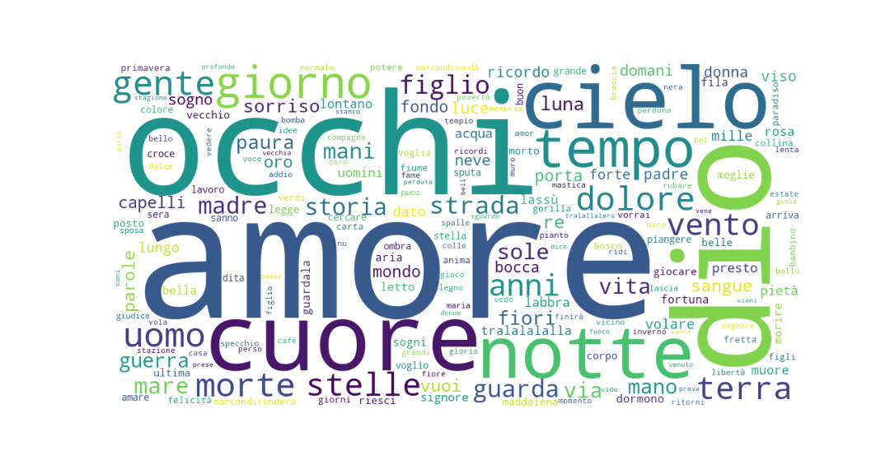
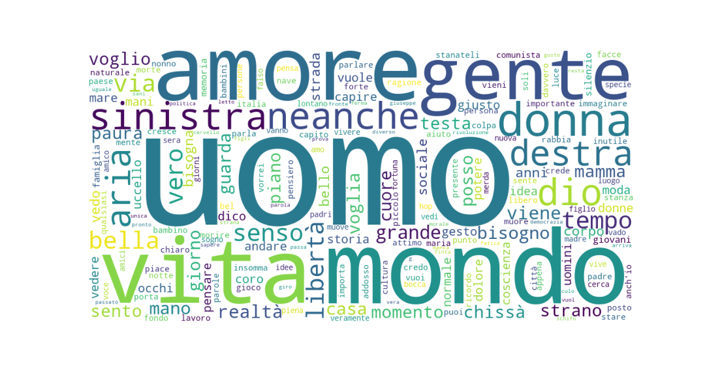
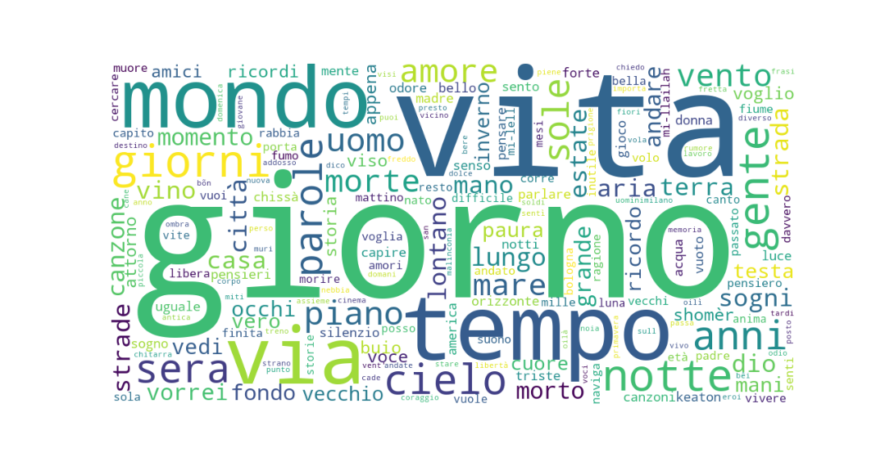

# lyrics_analysis_italian_singers
Lyrics analysis and comparison of three Italian singers - Fabrizio De André, Giorgio Gaber and Francesco Guccini.

Please note that nbviewer (https://nbviewer.org/) is recommended to open the [Lyrics_analysis_comparison_Italian_singers.ipynb](Lyrics_analysis_comparison_Italian_singers.ipynb) file (simply copy-paste the page link).

The project can also be viewed by section, according to the following steps:

##### STEP 1 - Web-scraping

See [1-Scraping.ipynb](1-Scraping.ipynb)

- Scraped the web to obtain the lyrics of three Italian singer-songwriters, in order to create one corpus per songwriter

##### STEP 2 - Word frequency comparison

See [2-Word_frequency_comparison.ipynb](2-Word_frequency_comparison.ipynb)
- Created a frequency distribution to see which words are most frequent in their lyrics production

##### STEP 3 - Spearman correlation

Spearman correlation assesses whether there is a correlation between two elements. 

- Compared the rankings to see the correlation between the corpora
- Removed stopwords from the corpora
- Recalculated the correlation
- Found common words among the three singers
- Recalculated the correlation between common word frequencies (with and without stopwords)

##### STEP 4 - Weirdness Index: how "typical" is a word in a songwriter's lyrics production?

- Calculated the weirdness index by taking into account the obtained corpora and a more generic corpus from Wikipedia

##### STEP 5 - Word Clouds

See [Word_Cloud.ipynb](Word_Cloud.ipynb)

Word Clouds represent weighted words. In this case, the most frequent words found in the lyrics of each singer are represented.  

Word Cloud for Fabrizio De André  
 

 

Word Cloud for Giorgio Gaber
 

 
 
 

Word Cloud for Francesco Guccini 
 

 
 
